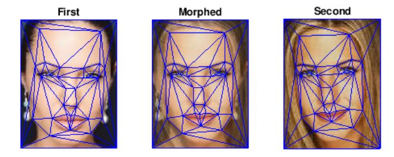

# Morphing Project

Morphing project consists of morphing 2 images into one:

* morphing = warphing + crossdisolve

The project is based on the EDx course [here](https://courses.edx.org/courses/course-v1:PennX+ROBO2x+2T2017/courseware/2205d61d7dc04e0f88e850534bb82117/f4b0b53d714346b488ff3c3e675e5735/1?activate_block_id=block-v1%3APennX%2BROBO2x%2B2T2017%2Btype%40vertical%2Bblock%40a47b6d5699c044fabd9f7b6c4df9aca1)